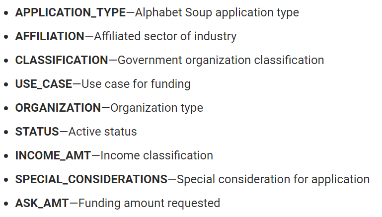
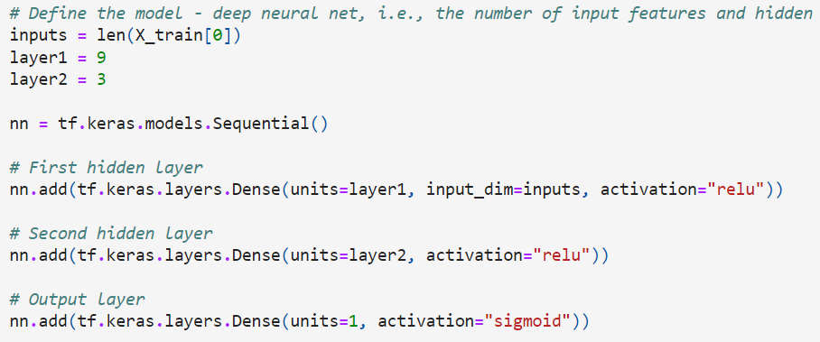
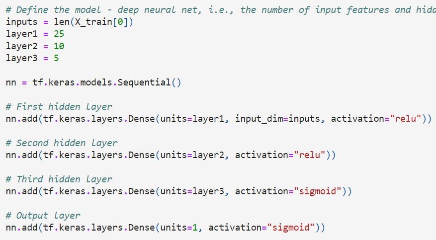

# Neural_Network_Charity_Analysis

## Overview
>In the Alphabet Soup Charity organization, there is a need for classifying funding beneficiaries as successful (or not).  This is to help ensure that funds are not being sent to recipients wastefully.  We are preparing and compiling data for a deep learning model that will attempt to predict with accuracy over 75% whether the recipient is a good selection or not.

## Results
>Ultimately I was unsuccessful after 10 or more optimization attempts to achieve the 75% accuracy score.  See answers to questions as follows:

### Data Preprocessing
*What variable(s) are considered the target(s) for your model?
> I identified the "IS_SUCCESSFUL" variable as the main target column.

*What variable(s) are considered to be the features for your model?
> There were several features as pictured below:
     

*What variable(s) are neither targets nor features, and should be removed from the input data?
> I removed EIN (identification number) and NAME columns.

### Compiling, Training, and Evaluating the Model
*How many neurons, layers, and activation functions did you select for your neural network model, and why?
>In the model pictured here, I tried to stay small (only 9 neurons) even though there were 44 input features.  I was concerned about having too complex of a model to start with.  88 was 10 times more than I was used to seeing. I instead added a second layer with 3 more neurons in hopes of improving performance. 
     

*Were you able to achieve the target model performance?
>No

What steps did you take to try and increase model performance?
>In the model pictured here, I chose to add additional neurons to each of the three layers that I had started with. I tried to change the third layer to a sigmoid function and had descending numbers of neurons in each layer.  This was after several iterative attempts at improvement, and with a hope of narrowing the risk of overfitting from so many parameters overall.
     

## Summary
Ultimately, I still could not get to the desired target.  I did try 3 layers of 88 neurons each.  I tried different combinations of functions, and I even tried doubling the epochs to 200.  Ultimatley, I came very close from time to time (74.8% was my most accurate epoch at one point).  I also tried using an automatic tuning function to see if I could get hyperparameters that worked for me. The best result still did not work for 75% accuracy.  I did try changing my preprocessing work to, for example, bucket more columns together.  But this seemed to have the opposite affect.  Bucketting fewer would have seemed to allow for every outlying category in the dataset.  In the end, trying a few more tweaks to the input categories could have made more difference to get over the edge to 75%. 